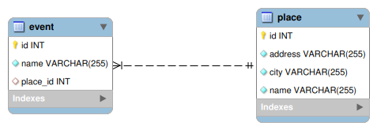

Spring and databases. Relationship in JPA
=========================================

Note: Schema == Database in MySQL


## DDL autogeneration

DDL – Data Definition Language

```
spring.jpa.hibernate.ddl-auto=update
```

https://www.geeksforgeeks.org/sql-ddl-dql-dml-dcl-tcl-commands/

## Логирование SQL запросов

https://www.baeldung.com/sql-logging-spring-boot

application.properties

```
logging.level.org.hibernate.SQL=debug
logging.level.org.hibernate.orm.jdbc.bind=trace
```

## Полезные аннотации

### Генерация ID

https://www.baeldung.com/hibernate-identifiers

```java
@Id
@GeneratedValue(strategy = GenerationType.IDENTITY)
private int id;
```

### Запрет на NULL значения в таблице

```
@NotNull
```

https://www.baeldung.com/hibernate-notnull-vs-nullable

## Полезные SQL-запросы

```
SHOW tables;
DESCRIBE [table_name];
SHOW CREATE TABLE [table_name];
```

## Relations




### @ManyToOne

Объявляется где есть ссылка на **один** объект.

```java
@ManyToOne
private Artist artist;
```

Полная версия

```java
@ManyToOne
@JoinColumn(name = "place_id", referencedColumnName = "id")
private Place place;
```

https://jakarta.ee/specifications/persistence/2.2/apidocs/javax/persistence/manytoone

https://jakarta.ee/specifications/persistence/2.2/apidocs/javax/persistence/joincolumn

### @OneToMany

```java
@OneToMany(mappedBy = "place")
private List<Event> events;
```

mappedBy - указываем поле где на самом деле хранится связь.

https://jakarta.ee/specifications/persistence/2.2/apidocs/javax/persistence/onetomany#mappedBy()

