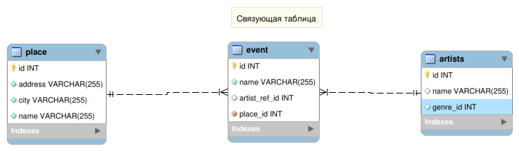

Spring and databases. Relationship in JPA. Many-to-many
=======================================================

## Many-to-Many

Отношение многие-ко-многим требует свзязующую таблицу.

The owner side is where we configure the relationship.



Place

```java
@ManyToMany
@JoinTable(
    name = "event",
    joinColumns = @JoinColumn(name = "place_id"),
    inverseJoinColumn=@JoinColumn(name = "artist_id"))
private List<Artist> artists;
```

Artist

```java
@ManyToMany(mappedBy = "artists")
private List<Place> places;
```


## Extend repository and custom requests

В репозитории можно добавлять свои запросы

- С помощью объявления методов в специальном формате
- С помощью запросов
    - На языке JPQL
    - На языке SQL(native, "нативные" запросы)

### Создание запросов при помощи названия методов

- Объявляем в репозитории метод со специальным названием
- Имплементацию писать не нужно, она сгенерируется из объявления метода

Возможности

- Поиск по полям
- Сортировка (desc, asc)
- Подсчет (count)
- Удаление по критериям

(https://www.javaguides.net/2018/11/spring-data-jpa-query-creation-from-method-names.html)

Примеры:

```java
public interface PlaceRepository extends JpaRepository<Place, Integer> {
    // Query using method naming.
    List<Place> findByCity(String city);
}
```

```
public interface UserRepository extends Repository<User, Long> {
  List<User> findByEmailAddressAndLastname(String emailAddress, String lastname);
  List<User> findByAgeBetween(Integer startAge, Integer endAge);
}
```

Ссылки:

- [Spring doc](https://docs.spring.io/spring-data/jpa/docs/current/reference/html/#repositories.query-methods)
- [Guide](https://www.javaguides.net/2018/11/spring-data-jpa-query-creation-from-method-names.html)
- [Guide2](https://www.baeldung.com/spring-data-derived-queries)

### JPQL

(https://en.wikipedia.org/wiki/Jakarta_Persistence_Query_Language)

>JPQL is used to make queries against entities stored in a relational database.
>It is heavily inspired by SQL, and its queries resemble SQL queries in syntax,
>but operate against JPA entity objects rather than directly with database tables. 

>JPQL используется для написания запросов к сущностям, хранящимся в реляционной базе данных.
>JPQL во многом похож на SQL, но в отличие от последнего, оперирует запросами,
>составленными по отношению к сущностям JPA, в отличие от прямых запросов к таблицам базы данных. 

Т.е. запрос пишется на языке похожем на SQL, но оперируете сущностями JPA(Entity).

Пример

```java
@Repository
public interface EventRepository extends JpaRepository<Event, Integer> {

    @Query("SELECT e FROM Event e INNER JOIN e.place p WHERE p.city = :city")
    List<Event> findFilteredByCity(@Param("city") String city);
}
```

### Native SQL

Запросы пишутся на самом настоящем SQL.

Примеры:

```java
@Query(value = "SELECT * FROM place e WHERE e.city = 'London'", nativeQuery = true)
List<Place> allLondonPlaces();
```

